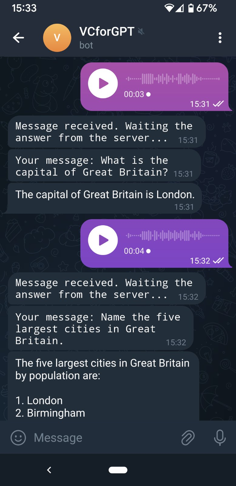
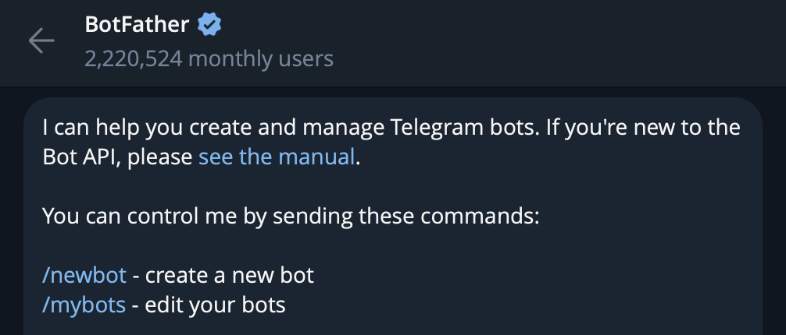

# Voice interface to interact with ChatGPT

## Installation & Configuration
1. Run `npm install`
2. Rename `config/development-sample.json` to `config/development.json` and fill in the `OPENAI_API_KEY` property with your OpenAI API key and `TELEGRAM_TOKEN` with your Telegram bot token.
3. Run `npm run dev` to start the app. Now you can open your bot on telegram and start using it by sending voice messages with your questions to ChatGPT.

## Interface

## How it works
1. Every time you record a voice message, Telegram saves it on its server in `.ogg` format. We find this file and copy it to the local `/voices` directory.
2. I convert thit `.ogg` media file to `.mp3` using `ffmpeg` library.
3. I use [**OpenAI's Speech to text**](https://platform.openai.com/docs/guides/speech-to-text) service to convert our MP3 message into text.
4. Now we can send that text to ChatGPT and show the response to the user.

## How to get OpenAI token
You can find/generate your OpenAI token [here](https://platform.openai.com/api-keys).

## How to get Telegram Bot token
1. Find **BotFather** bot on Telegram and execute `/newbot` to create a new bot.
   
2. Answer all the questions of the bot and on the end you'll obtain a token that will look like `1234567890:SGVBDNWRHghfhdfghTHgddRRWGDFSG`

If you already have a bot you can execute `/mybots` command. It will pop-up the list of your bots. Click on the right one and then click on **API Token** button.
